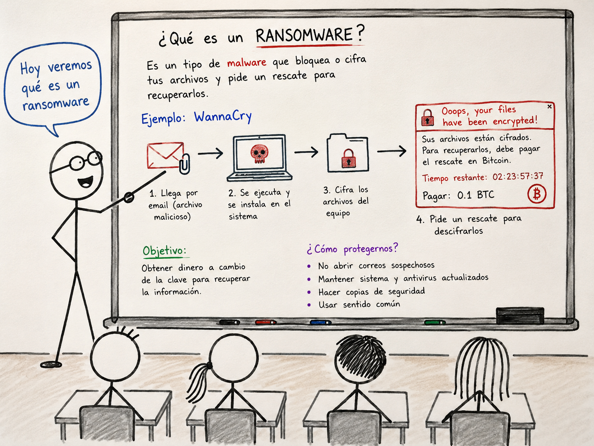

### Ransomware-Cutre

Un ransomware cutre y simple, programado en C en menos de 50 líneas de código.
Este proyecto fue creado con fines educativos, orientado al entendimiento de cómo funcionan este tipo de malware de manera básica.

⚠️ Aviso importante
Este código no debe ser utilizado con fines maliciosos.
El objetivo es aprender y comprender el funcionamiento de los ransomware, no causar daño.
Si lo usas con intenciones irresponsables, la responsabilidad es únicamente tuya.

---

📖 Descripción

• Implementado en C de forma minimalista.
• Utiliza el algoritmo de cifrado ChaCha20.
• Emplea la misma clave y nonce en cada operación, lo que lo convierte en un cifrador y descifrador al mismo tiempo.
• Es un ejemplo conceptual: no se compara con la sofisticación de los ransomware modernos.

---

🚀 Objetivo educativo

• Mostrar cómo se puede cifrar y descifrar archivos con un algoritmo de flujo.
• Entender la lógica detrás de un ransomware de manera segura y controlada.
• Servir como ejemplo académico para estudiantes y curiosos de la programación en C y la seguridad informática como yo.

---

🔄 Flujo simple de ChaCha20

Texto plano 
   → XOR con flujo generado (clave + nonce) 
   → Texto cifrado 
   → XOR con el mismo flujo (clave + nonce) 
   → Texto plano

---
